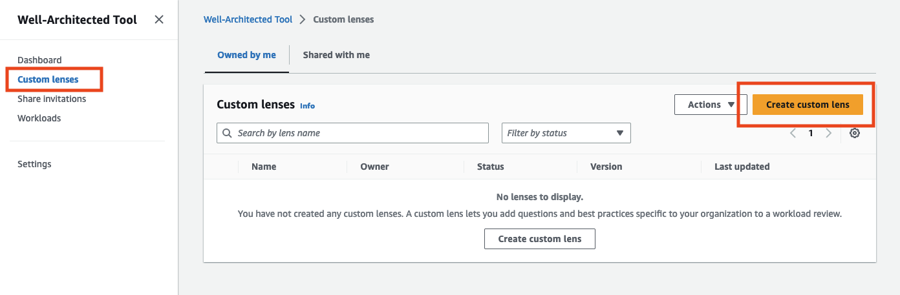
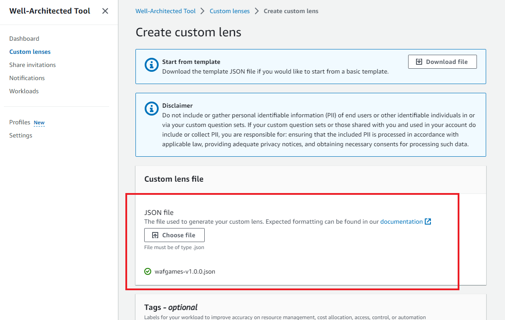
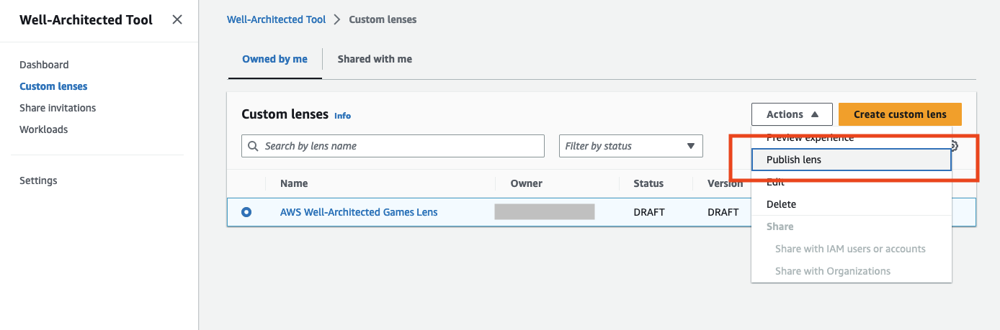
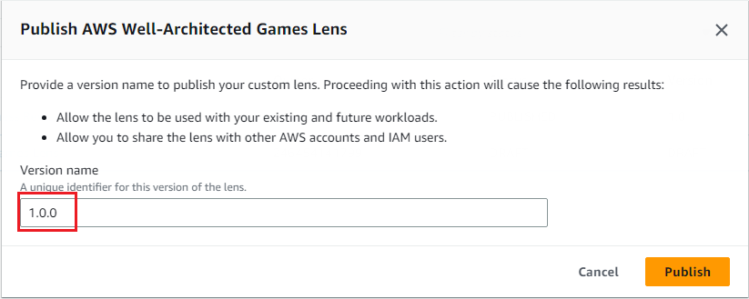
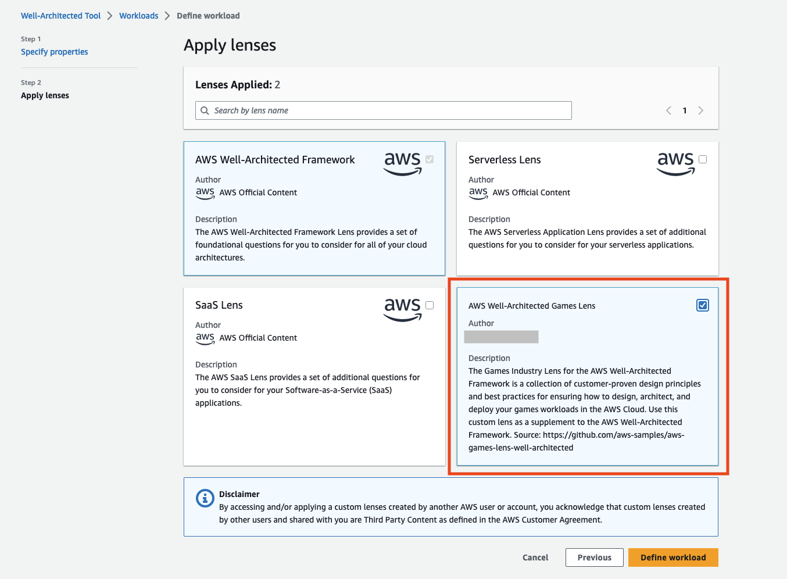

## AWS Games Industry Lens for Well-Architected

## Introduction

This repository holds the latest version of the Games Industry Lens for the AWS Well-Architected Framework.  The Lens is for AWS customers and partners to use when assessing Game Workloads for best practices and design principles according to the AWS Well-Architected framework. 

The Games Industry Lens is available in whitepaper (HTML) format and PDF format (for download) at the AWS docs site: https://docs.aws.amazon.com/wellarchitected/latest/games-industry-lens/games-industry-lens.html

This Lens is provided as a JSON file to upload into your AWS account to use when reviewing your workload. To add this lens as a [Custom lens for the AWS Well Architected Tool](https://docs.aws.amazon.com/wellarchitected/latest/userguide/lenses-custom.html), follow the steps 
under ["New Installation"](#new-installation), below. 

---

## New Installation

1. Clone this repository and check the `aws-games-lens-well-architcted` directory for a file named "wafgames-(version).json", and select the highest version available.

2. Once you've identified the file, go into the AWS Console and navigate the the Well Architected tool by either using the search option or select "Services > Management & Governance > AWS Well-Architected Tool". Then open the Custom Lens page and select "Create Custom Lens".

3. Click the "Choose File" button to navigate to the `wafgames-(version).json` file that you identified earlier. Click "Submit".

> If you get any error messages at the top of the screen when you import the file then check the error message carefully. You cannot have two custom lenses with the same unique identifier, and the error message will say as such. See below for ["Upgrading an existing lens"](#upgrading-an-existing-lens). For other errors / issues kindly reach out to the repository maintainer or make the appropriate modifications yourself to the file. 

> If you get an error message about questions not passing validation, then please reach out to the repository maintainer for assistance.

4. Once the lens has been imported, it should have a status of "DRAFT".

5. Click the "Actions" -> "Publish lens" option.  

6. Give the custom lens a version name. Its easiest to copy the version number from the file name, such as v1.3.2, but any version will do since you are only importing for use in your own account.  Click Publish.

---

## Upgrading an existing lens

Once you've imported a lens, you may want to check periodically for updates. 
You can check the `aws-games-lens-well-architcted` repository to see if there's a new version available.
If there is, download the file and go back to the Well Architected Console. Go to Custom Lenses and select `AWS Well-Architected Games Lens`. 
Click "Edit" and then click "Choose File" and navigate to the new lens version and click "Submit. On the Overview tab click "Publish lens". 

Give the new lens version a version name and publish it. 

The next time you go to the Workloads tab, you'll be prompted to upgrade any workload review that was using the old version of the lens. As part of the ugprade process, 
you'll be asked to save the current state of the review as a "milestone" so that you can go back and reference it at any time. 

---

## Beginning a new review

Once the `AWS Well-Architected Games Lens` is installed as a new custom lens from the prior steps, it can be used in a workload evaluation.

Go to the "Workloads" tab of the [Well-Architected Tool](https://console.aws.amazon.com/wellarchitected) Console and click "Define workload".  
Fill out the name, description, review owner, and other prompted fields from the console. When done, click "Next". 

You must have the "AWS Well-Architected Framework" as a selected lens, but you can also check off the "AWS Well-Architected Games Lens" to add it to the question list. 
Then click "Define Workload" and then the "Start Reviewing" dropdown menu on the next page. From the dropdown menu you can start with either a Well Architected Framework review or the Games Review.

---

## Feedback, Suggestions, and Support

If you run into issues, please double check the official [Well Architected Tool documentation](https://docs.aws.amazon.com/wellarchitected/latest/userguide/intro.html) for updated guidance on importing a new custom lens, upgrading a custom lens, or beginning a review.

If you have any feedback about the lens, suggestions for new questions, or further ideas on remediation text, please raise it as a [Gitlab Issue](Insert Github Link).

If you would like to help improve this lens, please see [CONTRIBUTING](CONTRIBUTING.md) for more information

---

## Security

See [CONTRIBUTING](CONTRIBUTING.md#security-issue-notifications) for more information.

---

## License

This library is licensed under the MIT-0 License. See the LICENSE file.